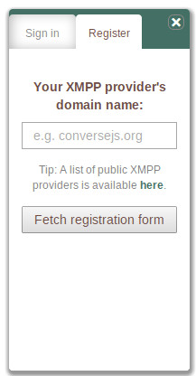
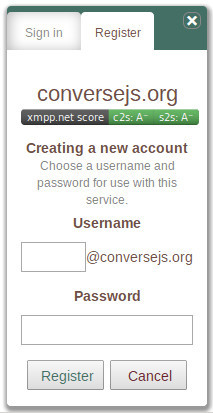
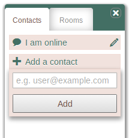
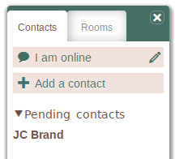
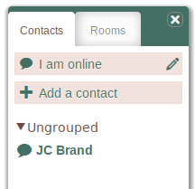
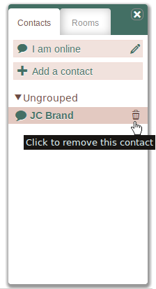

.. raw:: html

    
<a href="https://github.com/jcbrand/converse.js/blob/master/docs/source/manual.rst">Edit me on GitHub</a>

===========================
The Converse.js User Manual
===========================

.. |br| raw:: html

    

.. contents:: Table of Contents
   :depth: 2
   :local:

   The converse.js website

**Welcome to the converse.js user manual**. This manual is very much still a work
in progress and is far from complete. Please bear in mind that it's the work of volunteers.

If you have requests or suggestions on how the manual can be improved or
expanded, then please `contact me <https://opkode.com/contact.html>`_
or create a new ticket on `Github <https://github.com/jcbrand/converse.js/issues>`_.

Although converse.js can be integrated into any website, for this user manual
we'll refer to the canonical version at https://conversejs.org.

This documentation also integrates the converse.js chat client, so you can try
out some of the steps right on this page! Just click the **Toggle chat** button
at the bottom right of the page to open the so-called *control box* of the
converse.js chat client.

Registering a new chat account
==============================

   The registration panel of converse.js

With converse.js you can register a new XMPP account on any publically available XMPP provider.
To do so, click the **Register** tab on the chat client.

You will then see the *registration panel* as shown in the picture below.

Choosing your provider
----------------------

Converse.js uses a chat protocol called XMPP (also known as Jabber) which allows "federation".
This means that it's similar to email, in the sense that people signed in at
different XMPP chat providers can still chat with one another.

For example, if you have a Yahoo! email account, you can send and receive emails from
a friend with a Google email account. In the same way, if you have a chat
account from **Conversejs.org**, you can send and receive chat messages with a
friend who has an account at `Jappix.com <https://jappix.com>`_.

There are many free providers online which allow you to register a new account.
You can see a list of some of them at `xmpp.net <https://xmpp.net/directory.php>`_.
The `xmpp.net <https://xmpp.net/directory.php>`_ website provides a security grading
for the XMPP servers of the providers, which is very useful. They are however sometimes
slow to add new servers to the list.
A larger list of XMPP providers is also available at `list.jabber.net <https://list.jabber.at/>`_.

You can find the domain name for a server under the *Domain* column at
`xmpp.net <https://xmpp.net/directory.php>`_. or the *Server* column at
`list.jabber.net <https://list.jabber.at/>`_.

Once you know which XMPP provider you'd like to use, you can type its domain
name and click the **Fetch registration form** button.

|br|

   The registration form

Filling out the registration form
---------------------------------

After you've clicked **Fetch registration form**, the chat client will contact
the chat provider, ask for its registration form and then present it to you.

Different chat providers have different registration forms, but they're all
relatively similar.

Check the security score
~~~~~~~~~~~~~~~~~~~~~~~~

At the top of the form you'll see a colored bar containing the text **xmpp.net score**.
This shows the security score for this server as determined by `xmpp.net <https://xmpp.net>`_
where you can test out a server for yourself. You should generally avoid providers with
a poor security score (colored in red).

Choosing a username
~~~~~~~~~~~~~~~~~~~

As you can see in the registration form, the **username** consists of two
parts separated with an **@** sign, similar to an email address.

The first part is your unique *handle* which you need to choose. The second part
is the domain name of the chat provider, the one which you chose in the previous step
when you fetched the registration form.

When you want to give someone your XMPP chat username, or when you want to add
someone else as a contact, you need to specify it in full, like you would an email address.

Once you've chosen your user name and password, click **Register**. If
Successful, you'll be automatically logged in to your new account.

|br|

   The form for adding a new contact

Adding a contact
================

In order to start chatting with someone, you first need to add them as a contact.

To do this, click the **Add a contact** link in the **Contacts** tab. This will
slide open a dropdown in which you can type the username of the person you'd
like to add.

Remember, an XMPP username (also called a JID or Jabber ID) is similar to an
email address, in that you have both the user's *handle* and the *domain name*
of the provider, separated with an **@** sign.

Once you've typed the username and clicked submit, your request will be sent to
this person. If they are online, they will immediately be notified of your
request, otherwise they'll see it next time they come online.

Technically, when you add someone as a contact, you're doing two things. Firstly,
you are adding the contact to your *roster* (think of it as an address book) and secondly
you are asking to be notified whenever that person comes online.

   A pending contact

A pending contact
-----------------

The person you are adding as a contact has the option to either accept or decline your request.
Until that decision has been made, they will appear in your roster as a
so-called *pending* contact. In other words, their final status is pending on whether
they accept or decline your request.

   A normal contact

A normal contact
----------------

If the person accepts your contact request, they will get a *chat status
indicator* in your roster and will also become clickable. Clicking on the name
of the user will open a chat box in which you can then start chatting with that
user.

   Removing a contact

Removing a contact
==================

To remove a contact, hover your mouse over their name and then click on the
trash icon. You will be prompted to confirm, and if you do, the contact will no
longer be visible in your roster.

