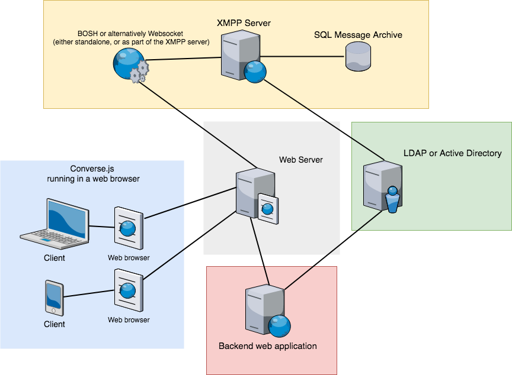

.. raw:: html

    
<a href="https://github.com/jcbrand/converse.js/blob/master/docs/source/setup.rst">Edit me on GitHub</a>

.. _what-you-will-need:

=====================
Setup and integration
=====================

This page documents what you'll need to do to be able to connect Converse with
your own XMPP server and to better integrate it into your website.

At the very least you'll need Converse and an :ref:`XMPP server` with
:ref:`websocket-section` or :ref:`BOSH-section` enabled. That's definitely
enough to simply demo Converse or to do development work on it.

For end-to-end encryption via OMEMO, you'll need to load `libsignal-protocol.js
<https://github.com/signalapp/libsignal-protocol-javascript>`_ separately in
your page. Take a look at the section on :ref:`libsignal <dependency-libsignal>` and the
:ref:`security considerations around OMEMO <feature-omemo>`.

If you want to more fully integrate it into a website
then you'll likely need to set up more services and components.

The diagram below shows a fairly common setup for a website or intranet:

* Converse runs in the web-browser on the user's device.

* It communicates with the XMPP server via BOSH or websocket which is usually
  reverse-proxied by a web-server in order to overcome cross-site scripting
  restrictions in the browser.

* Optionally the XMPP server is configured to use a SQL database for storing
  archived chat messages.

* Optionally there is a user directory such as Active Directory or LDAP, which
  the XMPP server is configured to use, so that users can log in with those
  credentials.

* Usually (but optionally) there is a backend web application which hosts a
  website in which Converse appears.

   This diagram shows the various services in a fairly common setup (image generated with `draw.io <https://draw.io>`_).

----------------------
The various components
----------------------

.. _`XMPP server`:

An XMPP server
==============

Converse uses `XMPP <https://xmpp.org/about-xmpp/>`_ as its
messaging protocol, and therefore needs to connect to an XMPP/Jabber
server (Jabber® is an older and more user-friendly synonym for XMPP).

You can connect to public XMPP servers like ``conversejs.org`` but if you want to
integrate Converse into your own website and to use your website's
authentication sessions to log in users to the XMPP server (i.e. :ref:`session support <session-support>`)
then you'll have to set up your own XMPP server.

You can find a list of public XMPP servers/providers on `compliance.conversations.im <http://compliance.conversations.im/>`_
and a list of servers that you can set up yourself on `xmpp.org <https://xmpp.org/xmpp-software/servers/>`_.

.. _`BOSH-section`:

BOSH (XMPP-over-HTTP)
=====================

Web-browsers do not allow the persistent, direct TCP socket connections used by
desktop XMPP clients to communicate with XMPP servers.

Instead, we have HTTP and websocket as available protocols.

`BOSH`_ can be seen as XMPP-over-HTTP. In other words, it allows for XMPP
stanzas to be sent over an HTTP connection.

HTTP connections are stateless and usually shortlived.
XMPP connections on the other hand are stateful and usually last much longer.

So to enable a web application like Converse to communicate with an XMPP
server, we need a proxy which acts as a bridge between these two protocols.

This is the job of a BOSH connection manager. BOSH (Bidirectional-streams Over
Synchronous HTTP) is a protocol for allowing XMPP communication over HTTP. The
protocol is defined in `XEP-0206: XMPP Over BOSH <https://xmpp.org/extensions/xep-0206.html>`_.

Popular XMPP servers such as `Ejabberd <http://www.ejabberd.im>`_,
Prosody `(mod_bosh) <http://prosody.im/doc/setting_up_bosh>`_ and
`OpenFire <http://www.igniterealtime.org/projects/openfire/>`_ all include
their own BOSH connection managers (but you usually have to enable them in the
configuration).

However, if you intend to support multiple different servers (like
https://conversejs.org does), then you'll need a standalone connection manager.

For a standalone manager, see for example `Punjab <https://github.com/twonds/punjab>`_
and `node-xmpp-bosh <https://github.com/dhruvbird/node-xmpp-bosh>`_.

The demo on the `Converse homepage <https://conversejs.org>`_ uses a connection
manager located at https://conversejs.org/http-bind.

This connection manager is available for testing purposes only, please don't
use it in production.

Refer to the :ref:`bosh-service-url` configuration setting for information on
how to configure Converse to connect to a BOSH URL.

Configuring your webserver for BOSH
-----------------------------------

Lets say the domain under which you host Converse is *example.org:80*,
but the domain of your connection manager or the domain of
your HTTP file server (for `XEP-0363 HTTP File Upload <https://xmpp.org/extensions/xep-0363.html>`_)
is at a different domain, either a different port like *example.org:5280* or a
different name like *elsehwere.org*.

In such a situation the same-origin security policy of the browser comes into force.
For security purposes a browser does not by default allow a website to
make certain types of requests to other domains.

There are two ways in which you can solve this problem.

.. _CORS:

1. Cross-Origin Resource Sharing (CORS)
~~~~~~~~~~~~~~~~~~~~~~~~~~~~~~~~~~~~~~~

CORS is a technique for overcoming browser restrictions related to the
`same-origin security policy <https://developer.mozilla.org/en-US/docs/Web/Security/Same-origin_policy>`_.

CORS is enabled by adding an ``Access-Control-Allow-Origin`` header. Where this
is configured depends on what webserver is used for your file upload server.

2. Reverse-proxy
~~~~~~~~~~~~~~~~

Another possible solution is to add a reverse proxy to a webserver such as Nginx or Apache to ensure that
all services you use are hosted under the same domain name and port.

Examples:
*********

Assuming your site is accessible on port ``80`` for the domain ``mysite.com``
and your connection manager manager is running at ``someothersite.com/http-bind``.

The *bosh_service_url* value you want to give Converse to overcome
the cross-domain restriction is ``mysite.com/http-bind`` and not
``someothersite.com/http-bind``.

Your ``nginx`` or ``apache`` configuration will look as follows:

Nginx
^^^^^

.. code-block:: nginx

    http {
        server {
            listen       80
            server_name  mysite.com;

            location = / {
                root    /path/to/converse.js/;  # Properly set the path here
                index   index.html;
            }
            location ~ ^/http-bind/ {
                proxy_pass http://someothersite.com;
            }
            # CORS
            location ~ .(ttf|ttc|otf|eot|woff|woff2|font.css|css|js)$ {
                add_header Access-Control-Allow-Origin "*"; # Decide here whether you want to allow all or only a particular domain
                root   /path/to/converse.js/;  # Properly set the path here
            }
        }
    }

Apache
^^^^^^

.. code-block:: apache

    <VirtualHost *:80>
        ServerName mysite.com
        RewriteEngine On
        RewriteRule ^/http-bind(.*) http://someothersite.com/http-bind$1 [P,L]
    </VirtualHost>

.. note::

    If you're getting XML parsing errors for your BOSH endpoint, for
    example::

        XML Parsing Error: mismatched tag. Expected: 
.
        Location: https://example.org/http-bind/
        Line Number 6, Column 3: bosh-anon:6:3
        Also ERROR: request id 12.2 error 504 happened

    Then your BOSH proxy is returning an HTML error page (for a 504 error in
    the above example).

    This might be because your webserver and BOSH proxy have the same timeout
    for BOSH requests. Because the webserver receives the request slightly earlier,
    it gives up a few microseconds before the XMPP server’s empty result and thus returns a
    504 error page containing HTML to browser, which then gets parsed as if its
    XML.

    To fix this, make sure that the webserver's timeout is slightly higher.
    In Nginx you can do this by adding ``proxy_read_timeout 61;``;

    From Converse 4.0.0 onwards the default ``wait`` time is set to 59 seconds, to avoid
    this problem.

.. _`websocket-section`:

Websocket
=========

Websockets provide an alternative means of connection to an XMPP server from
your browser.

Websockets provide long-lived, bidirectional connections which do not rely on
HTTP. Therefore BOSH, which operates over HTTP, doesn't apply to websockets.

`Prosody <http://prosody.im>`_ (from version 0.10) and `Ejabberd <http://www.ejabberd.im>`_ support websocket connections, as
does the node-xmpp-bosh connection manager.

Refer to the :ref:`websocket-url` configuration setting for information on how to
configure Converse to connect to a websocket URL.

Reverse-proxy for a websocket connection
----------------------------------------

Assuming your website is accessible on port ``443`` on the domain ``mysite.com``
and your XMPP server's websocket server is running at ``localhost:5280/xmpp-websocket``.

You can then set up your webserver as an SSL enabled reverse proxy  in front of
your websocket endpoint.

The :ref:`websocket-url` value you'll want to pass in to ``converse.initialize`` is ``wss://mysite.com/xmpp-websocket``.

Your ``nginx`` will look as follows:

.. code-block:: nginx

    http {
        server {
            listen       443
            server_name  mysite.com;
            ssl on;
            ssl_certificate /path/to/fullchain.pem;    # Properly set the path here
            ssl_certificate_key /path/to/privkey.pem;    # Properly set the path here

            location = / {
                root    /path/to/converse.js/;  # Properly set the path here
                index   index.html;
            }
            location /xmpp-websocket {
                proxy_http_version 1.1;
                proxy_pass http://127.0.0.1:5280;
                proxy_buffering off;
                proxy_set_header Host $host;
                proxy_set_header Upgrade $http_upgrade;
                proxy_set_header Connection "upgrade";
                proxy_read_timeout 86400;
            }
            # CORS
            location ~ .(ttf|ttc|otf|eot|woff|woff2|font.css|css|js)$ {
                add_header Access-Control-Allow-Origin "*"; # Decide here whether you want to allow all or only a particular domain
                root   /path/to/converse.js/;  # Properly set the path here
            }
        }
    }
